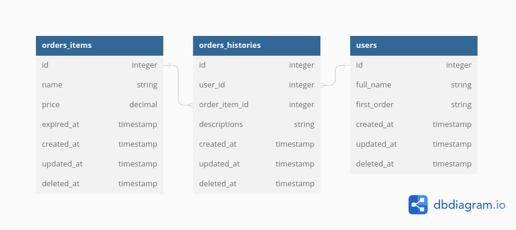

# Product Management

## Setup

## Documentation

### ERD

### API Contract

[POSTMAN Docs](https://documenter.getpostman.com/view/10632868/2s93XyU3TE)

## Task

- [x] Please use Golang as a programing language
- [x] Use echo framework
- [ ] 5 endpoint (create, list, detail, update, delete) for each table using clean architecture
- [x] Use concurrent request to handle multiple request at same time, when insert, get data
- [x] Use Persistent database postgresql/mysql, use redis as cache
- [ ] Please show Logs in file, pre request, and post request
- [x] Use environment file (.env) to handle all credentials setting (port, db cred, redis cred )
- [x] Api Documentation (please using postman documentation)
- [x] Put your code and documentation in your Github repository, and please share the url
